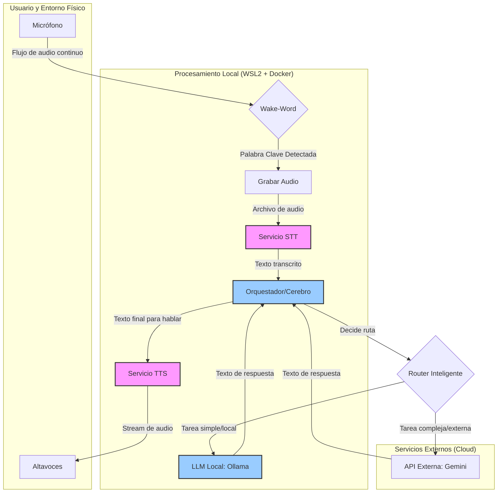

# 01 - Arquitectura General del Sistema

**Fecha de Sincronización:** 16 de Julio de 2025

## 1. Paradigma de Microservicios

El sistema está diseñado como un conjunto de **microservicios independientes** que se comunican a través de APIs REST. Esta arquitectura desacoplada permite:
-   Desarrollar, probar y actualizar cada componente de forma aislada.
-   Reemplazar un componente (ej. cambiar el modelo de TTS) sin afectar al resto del sistema.
-   Escalar los servicios de forma independiente si fuera necesario.

La orquestación de estos servicios se realiza a través de **Docker y Docker Compose**, lo que garantiza un entorno de ejecución consistente y reproducible.

## 2. Flujo de Datos de Interacción por Voz

El siguiente diagrama ilustra el flujo de datos para una interacción de voz completa, desde la activación hasta la respuesta hablada.

### Descripción del Flujo:

1.  **Activación (Wake-Word):** Un proceso ligero escucha constantemente a través del `Micrófono` (A) por una palabra clave (B).
2.  **Captura (STT):** Al detectar la palabra, se graba el audio del usuario (C) y se envía al **Servicio STT** (F).
3.  **Transcripción:** El servicio STT procesa el audio y devuelve el texto crudo al **Orquestador** (G).
4.  **Razonamiento (Router):** El Orquestador (G) actúa como el cerebro. Analiza el texto y, a través de un Router Inteligente (I), decide si la petición puede ser manejada por el **LLM local vía Ollama** (H) o si requiere el conocimiento de una **API Externa como Gemini** (J).
5.  **Generación de Respuesta:** El LLM correspondiente (H o J) genera la respuesta en formato de texto y la devuelve al Orquestador.
6.  **Síntesis de Voz (TTS):** El Orquestador envía el texto de la respuesta final al **Servicio TTS** (K).
7.  **Respuesta Audible:** El servicio TTS convierte el texto en un stream de audio que se reproduce en los `Altavoces` (L).
